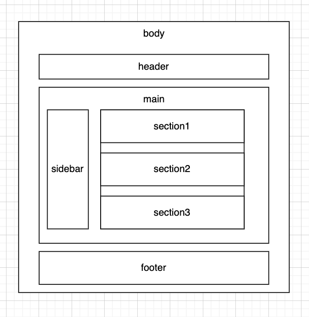

# First Project

## Overview

This repository contains a simple HTML website designed to practice essential web development concepts, including CSS styling with inline, internal, and external styles, as well as the use of semantic HTML tags ... etc. 

## Structure

The website follows a basic structure:

This structure represents the hierarchy of the HTML elements used in the project. Each section has a specific purpose for whcih improve website in term of readability, accessbility, and SEO.

The structure of body consists of three elements:  

- **header**: which includes the navbar 

- **main**: which has the sidebar and main sections.

- **footer**: which is meant to have the copyright statement.
